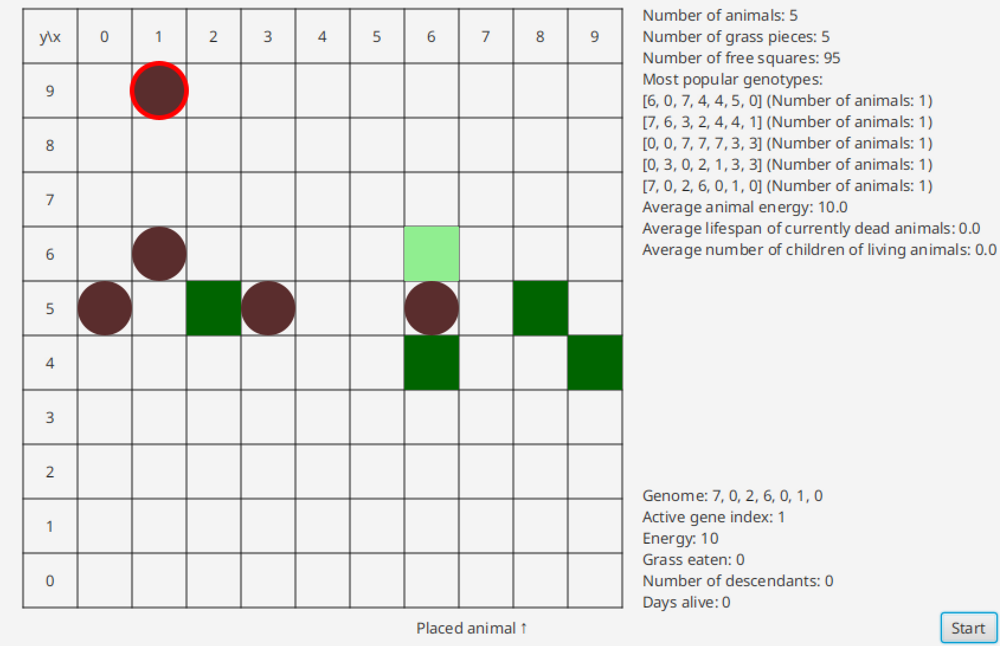

# Darwin World

## Description

This project is a grid-based zero-player game based around the idea of evolution.
The grid is inhabited by animals which compete to survive and preserve their genes through their offspring.
The project was made as part of the Object-Oriented Programming course at AGH University of Krakow and implemented based on the specification provided [here](https://github.com/Soamid/obiektowe-lab/blob/master/proj/Readme.md) with the GUI using JavaFX.



## Prerequisites

Java Development Kit 21 is required to compile and run the program.

## Usage

The program is compiled and run with Gradle from the oolab directory.
Gradle Wrapper is present in the oolab directory, so Gradle itself needn't be installed - while in the oolab directory execute the script:
```sh
./gradlew run        # On Linux/MacOS
```
```powershell
.\gradlew.bat run    # On Windows
```

## License

This program is licensed under the GNU GPLv3. See the *LICENSE* file for details.

## Authors

+ Bartosz Kaganiec
+ Mateusz Kosman